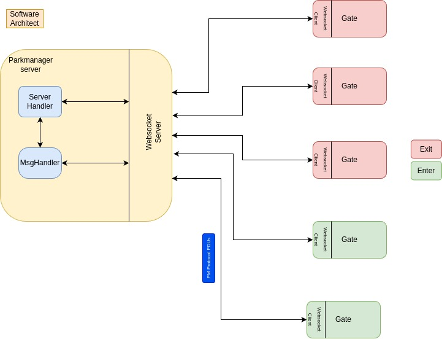
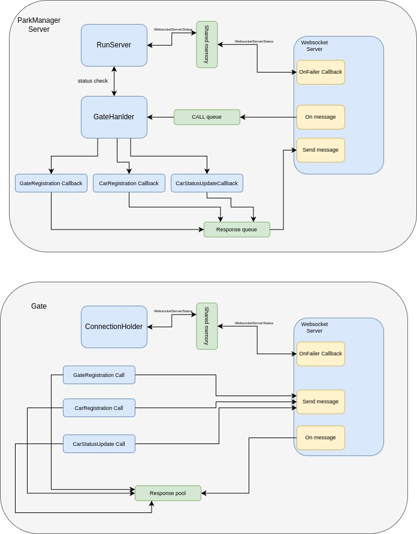
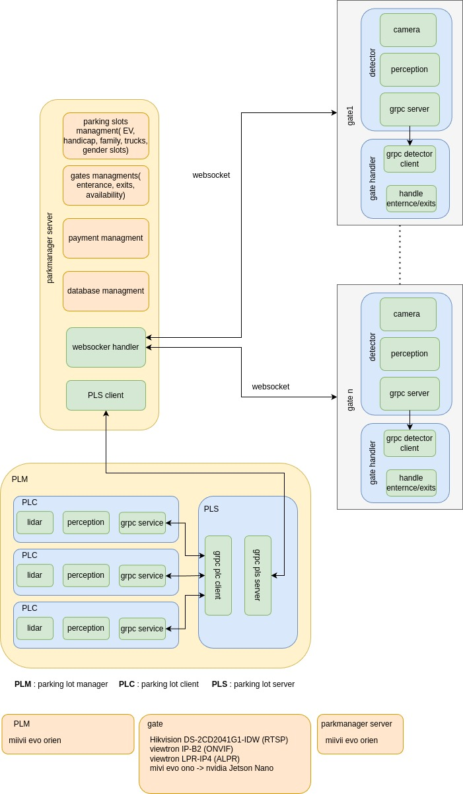
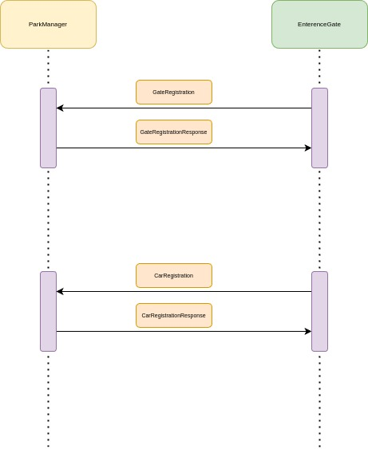
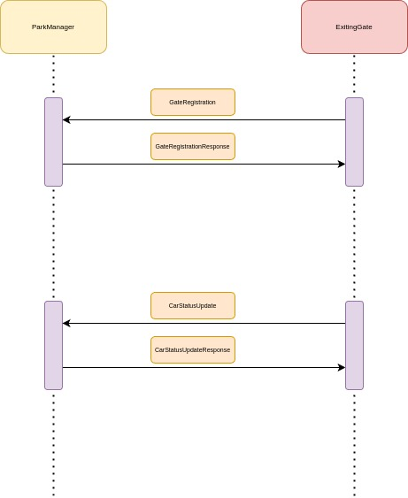
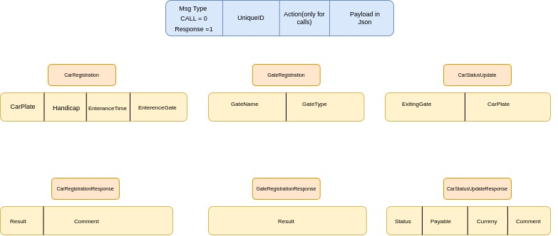

# Project Documentation

this is a mini project providing a concept of how to build a standalone parking management system. no hardware is considered here, the software can be used on any CPU architect with c++14 or higher. and the project is a complete software stack.
clients are the entrance and exit gates. and the server is the park manager.
On startup, each client should register with the server as an entrance or exit and get permission. each car at the entrance will be assigned an id based on its nameplate which will be used at the exit to calculate the parking cost.
there are two types of parking spaces: normal and parking spaces for Handicaps ( can be extended for ev charging parking spaces).
check the ready-to-use example for the x86 system provided to find out more about the configuration.
This repository contains the source code and related materials for managing and testing parking systems.

---

## **How to Compile**

To compile the project, follow these steps:

```bash
mkdir build
cd build
cmake ..
make
```

**Example Project**:

- A ready-to-run project is available in `examplePackageX86`.

---

## **Park Manager (Server)**

### **Setup Instructions**:

1. Ensure the `config.ini` file is present and that its absolute path is either:

   - Provided during class initialization.
   - Set in the `ConfigPath` value in `CommonLibraries/utils.hpp`.

2. The server must have **read** and **write** access to the directory where `config.ini` is located.

3. Start the server.

4. The user (execution user) must have **write access** to `/dev/shm`.

## **Park Manager (client)**

### **Setup Instructions**:

1. Ensure the `config.ini` file is present and that its absolute path is either:

   - Provided during class initialization.
   - Set in the `ConfigPath` value in `CommonLibraries/utils.hpp`.

2. The client must have **read** and **write** access to the directory where `config.ini` is located.

3. Start the client.

4. The user (execution user) must have **write access** to `/dev/shm`.

## **Test units**

after compiling the project test units are also created. a ready to use test unit is available in `examplePackageX86` follow these steps to check the results.

1. run the TestUnits in `examplePackageX86/TestUnit`
   this is a test for two senarios using cute
   I. one enterence Gate and one Exiting Gate
   II. three enterence Gates and three exiting gates
2. please make sure the user ( excuter user) has write access to `/dev/shm`

### **Monitor Logs Locally**:

Set the following environment variables:

```bash
export LOG_PRINT_LEVEL=0
export LOG_LEVEL=0
```

## Software Architecture Design

The following diagram illustrates the high-level software architecture design:



The architecture highlights the relationships between perception software, firmware components, and the cloud interface.

## Modular Design

The following diagram illustrates the modular design:



## System Design

The following diagram illustrates a built and tested system which uses this project:



## entrance sequence

entrance procedure and handshakes between the gate and the server:



## exit sequence

exit procedure and handshakes between the gate and the server:



## PDU format

protocol defined for websocket communication:


